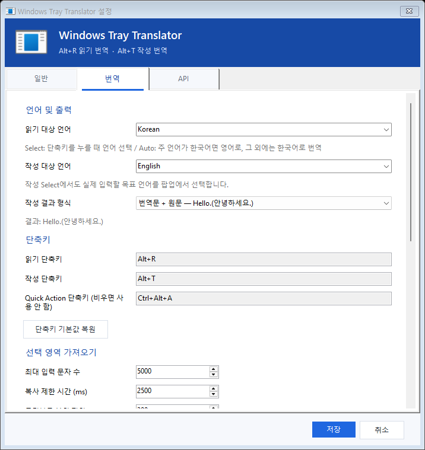
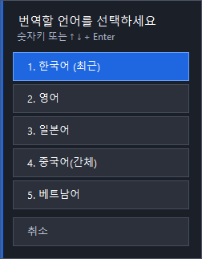
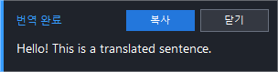

<p align="center">
  
</p>

<h1 align="center">Windows Tray Translator</h1>

<p align="center">
  Windows에서 텍스트를 선택하고 단축키만 누르면<br>
  Gemini가 번역·요약·문장 다듬기를 실행하는 가벼운 트레이 앱입니다.
</p>

<p align="center">
  <a href="https://github.com/nothing2that-sys/windows-tray-translator/releases/latest"><strong>최신 버전 다운로드</strong></a>
  · <a href="doc/WindowsTrayTranslator_UserManual.html">사용자 매뉴얼</a>
  · <a href="PRIVACY.md">개인정보 안내</a>
</p>

<p align="center">
  <a href="https://github.com/nothing2that-sys/windows-tray-translator/actions/workflows/ci.yml"></a>
  <a href="https://github.com/nothing2that-sys/windows-tray-translator/releases/latest"></a>
  
  <a href="LICENSE"></a>
</p>



## 3단계로 사용하기

1. 메모장, 브라우저, IDE 등에서 번역할 문장을 선택합니다.
2. 원하는 작업의 단축키를 누릅니다.
3. 결과를 확인하거나 선택 영역을 번역문으로 교체합니다.

| 단축키 | 기능 | 원문 변경 |
|---|---|---:|
| `Alt+R` | 선택 문장을 번역하여 팝업에 표시 | 안 함 |
| `Alt+T` | 선택 문장을 번역하고 같은 영역을 교체 | 함 |
| `Ctrl+Alt+A` | 자연스럽게 다듬기, 요약, 번역 후 요약 | 안 함 |

<table>
  <tr>
    <td align="center"></td>
    <td align="center"></td>
  </tr>
  <tr>
    <td align="center">언어를 즉시 선택</td>
    <td align="center">결과 확인 후 복사</td>
  </tr>
</table>

## 설치

### 권장: Installer

1. [WindowsTrayTranslator-Setup-1.3.1-x64.exe](https://github.com/nothing2that-sys/windows-tray-translator/releases/download/v1.3.1/WindowsTrayTranslator-Setup-1.3.1-x64.exe)를 다운로드합니다.
2. 설치 프로그램을 실행합니다.
3. 트레이 아이콘을 더블클릭하고 `API` 탭에서 Gemini API Key를 저장합니다.
4. 메모장 등에서 문장을 선택한 뒤 `Alt+R`로 확인합니다.

설치 없이 사용하려면 [Portable ZIP](https://github.com/nothing2that-sys/windows-tray-translator/releases/download/v1.3.1/WindowsTrayTranslator-Portable-1.3.1-x64.zip)을 내려받아 압축을 풀고 `WindowsTrayTranslator.exe`를 실행하세요.

> 현재 설치 파일은 코드 서명되지 않았습니다. Windows SmartScreen 경고가 나타날 수 있으며, 다운로드한 파일은 같은 Release의 [`SHA256SUMS.txt`](https://github.com/nothing2that-sys/windows-tray-translator/releases/download/v1.3.1/SHA256SUMS.txt)로 검증할 수 있습니다.

### 요구 환경

- Windows 11 x64
- Gemini API Key — [Google AI Studio에서 발급](https://aistudio.google.com/app/apikey)
- 실행 파일에는 .NET 10 Windows x64 Runtime이 포함되어 별도 Runtime 설치가 필요하지 않습니다.

## 어떻게 동작하나요?

```text
텍스트 선택
   ↓
단축키 입력
   ↓
보호된 입력 영역 및 활성 창 확인
   ↓
선택 문자열 캡처 → Gemini API 요청
   ↓
결과 팝업 표시 또는 안전한 선택 영역 교체
```

- 기본적으로 자동 `Ctrl+C`로 선택 문자열을 가져오고, 지원하지 않는 앱에서는 Windows UI Automation을 시도합니다.
- 비밀번호 입력란처럼 보호된 영역으로 확인되면 클립보드와 Gemini API에 접근하지 않습니다.
- `Alt+T` 처리 중 활성 창이나 포커스가 달라지면 자동 교체를 취소하고 결과만 보여 줍니다.
- 기존 클립보드는 가능한 형식을 함께 백업하고 작업 후 복원합니다.
- API Key는 설정 JSON이 아닌 Windows DPAPI CurrentUser 범위의 `secrets.dat`에 암호화하여 저장합니다.

선택 문자열은 번역을 위해 Gemini API로 전송됩니다. 회사 기밀, 개인정보 또는 외부 전송이 금지된 내용에는 사용하지 마세요. 자세한 저장·전송 범위는 [PRIVACY.md](PRIVACY.md)를 확인하세요.

## 주요 기능

- `Select` 또는 `Auto` 대상 언어와 한국어·영어·일본어·중국어(간체)·베트남어 지원
- Natural, Literal, Business 번역 스타일과 말투 설정
- 사용자 지침, 용어집, 번역 제외 단어
- 작성 결과 형식 4종
- 번역 모델과 Quick Action 모델 분리
- 기본 모델 실패 시 보조 모델 전환
- 사용자 지정 전역 단축키와 충돌 복구
- 번역 히스토리 선택 저장 — 기본값 OFF
- Windows 시작 프로그램 등록

<details>
<summary><strong>설정과 런타임 데이터 자세히 보기</strong></summary>

트레이 아이콘을 더블클릭하거나 우클릭 후 `설정 열기`를 선택합니다.

- `일반`: 번역 활성화, 자동 시작, 팝업 시간, 진단 로그, 번역 히스토리
- `번역`: 대상 언어, 결과 형식, 단축키, 번역 스타일, 용어집
- `API`: API Key, 모델, Quick Action 모델, 제한 시간, 재시도, 연결 테스트

런타임 데이터는 설치 폴더와 분리됩니다.

```text
%LOCALAPPDATA%\WindowsTrayTranslator\
├── config\appsettings.json
├── secrets.dat
├── logs\
└── history\
```

히스토리는 사용자가 명시적으로 켠 경우에만 원문과 번역문을 저장합니다.

</details>

## 알려진 제한사항

- 자체 렌더링된 일부 웹 입력 요소에서는 같은 창 안의 포커스 변경을 완벽히 식별하지 못할 수 있습니다.
- 일부 앱 전용 클립보드 형식은 안전하게 백업할 수 없어 캡처를 취소할 수 있습니다.
- 현재 앱보다 높은 권한으로 실행된 프로그램에는 Windows가 `SendInput`을 차단할 수 있습니다.
- 설치 프로그램은 아직 코드 서명되지 않았습니다.

## 개발 및 빌드

필요 환경: Windows, .NET 10 SDK (`global.json`), Installer 생성 시 Inno Setup 6.

```powershell
dotnet restore WindowsTrayTranslator.sln
./scripts/build.ps1
./scripts/test.ps1
./scripts/package-release.ps1 -NoRestore
```

Release 산출물은 `artifacts\release\<version>`에 생성되며 Git에는 포함하지 않습니다. GitHub Release에는 Installer, Portable ZIP, `SHA256SUMS.txt`만 게시합니다.

실제 Gemini 호출 테스트는 API Key가 필요한 opt-in 테스트이며 기본 CI에서는 실행하지 않습니다. 배포본 수동 확인은 [체크리스트](doc/Phase7_ManualTestChecklist.md)를 참고하세요.

## 보안 및 라이선스

보안 문제는 공개 Issue 대신 [SECURITY.md](SECURITY.md)의 비공개 신고 절차를 이용해 주세요. 이 프로젝트는 [MIT License](LICENSE)로 배포되며 외부 구성 요소는 [THIRD_PARTY_NOTICES.md](THIRD_PARTY_NOTICES.md)를 참고하세요.
